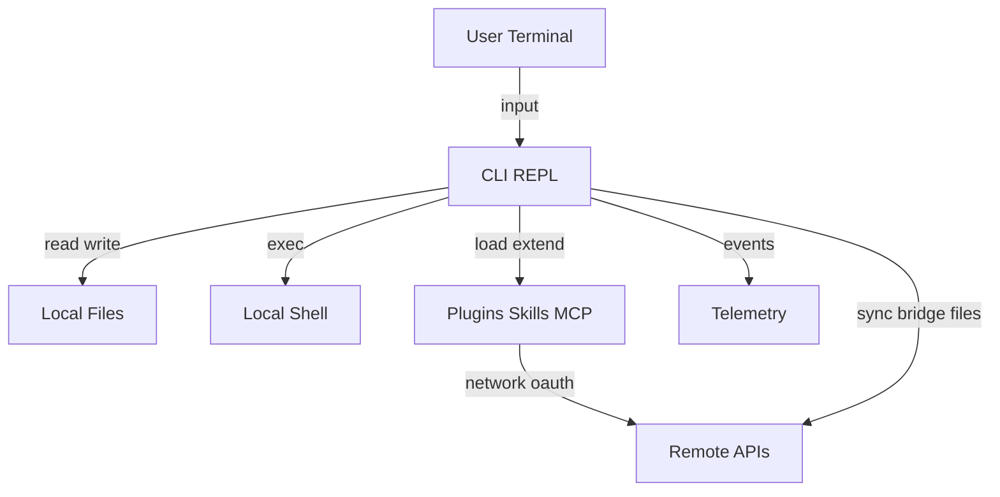

# Claude Code Leaked Source Code Threat Model

## Executive summary

该仓库是一个高权限本地 agent 宿主，而不是单纯的 UI 或 SDK 示例。最高风险集中在 4 个面向：本地命令执行与文件访问、插件与 MCP 扩展、远程桥接与同步能力、以及将完整源码直接暴露给 AI 进行参考式重开发。在你当前场景下，最大的现实风险不是“运行后立即恶意破坏”，而是你在主力机上分析代码时，敏感文件、凭据、终端上下文、历史配置和私有仓库内容被 AI 工具链、插件、远程同步或后续误操作间接带出。

## Scope and assumptions

- In-scope paths:
  - `2.1.88/src`
- Out-of-scope items:
  - `.git`
  - 构建产物、测试用例、未展开的外部依赖源码
- Assumptions:
  - 你主要在日常使用电脑的终端中分析该仓库，不计划主动完整运行其产品功能。
  - 你会让 AI 直接读取全部源码，用于学习设计与参考式重开发。
  - 你当前更关注本地数据泄露、凭据暴露、越界联网和重开发阶段的安全边界，而不是线上生产环境攻击。
  - 由于未发现完整 README、部署文档和后端服务定义，远端 API 的实际服务端控制能力按“存在但未知”处理。
- Open questions:
  - 你后续是否会把私有业务代码、`.env`、SSH key 所在目录一并暴露给 AI 工作区。
  - 你重开发时是否会允许 AI 自动执行 shell、联网安装依赖、访问浏览器或连接第三方 MCP。

## System model

### Primary components

- `CLI 启动与初始化`
  - 负责启动时副作用、配置装载、鉴权、远程设置、工具与命令注册。
  - Evidence anchors: `src/main.tsx`, `init()`, `launchRepl()`
- `REPL 交互层`
  - 承载会话、消息流、工具调用、远程会话接入、权限请求与 UI。
  - Evidence anchors: `src/screens/REPL.tsx`, `useRemoteSession`, `useDirectConnect`, `useSSHSession`
- `工具执行层`
  - 具备本地 shell 执行、文件读写、网页抓取、网页搜索、agent 派生等能力。
  - Evidence anchors: `src/tools/BashTool/BashTool.tsx`, `src/tools/FileReadTool/FileReadTool.ts`, `src/tools/FileEditTool/FileEditTool.ts`, `src/tools/WebFetchTool/WebFetchTool.ts`, `src/tools/WebSearchTool/WebSearchTool.ts`
- `权限与约束层`
  - 管理工具权限、危险命令模式、自动模式约束、文件系统访问控制。
  - Evidence anchors: `src/utils/permissions/permissionSetup.ts`
- `插件 / Skills / MCP 扩展层`
  - 从 marketplace、本地目录、项目目录加载扩展，并支持 MCP OAuth 与远程连接。
  - Evidence anchors: `src/utils/plugins/pluginLoader.ts`, `src/utils/plugins/marketplaceManager.ts`, `src/skills/loadSkillsDir.ts`, `src/services/mcp/auth.ts`
- `远程桥接与同步层`
  - 支持远程环境注册、会话桥接、团队记忆同步、用户设置同步、远程托管设置。
  - Evidence anchors: `src/bridge/bridgeApi.ts`, `src/services/teamMemorySync/index.ts`, `src/services/settingsSync/index.ts`, `src/services/remoteManagedSettings/index.ts`
- `凭据与安全存储层`
  - 处理 OAuth、API key、macOS keychain 与非 macOS 明文回退存储。
  - Evidence anchors: `src/utils/auth.ts`, `src/utils/secureStorage/keychainPrefetch.ts`, `src/utils/secureStorage/index.ts`, `src/utils/secureStorage/plainTextStorage.ts`

### Data flows and trust boundaries

- User terminal -> CLI/REPL
  - Data: prompt、命令行参数、stdin、文件路径、工作目录
  - Channel: 本地进程 / TTY
  - Security guarantees: 仅本地进程边界，无额外隔离
  - Validation: 部分命令/路径校验，取决于具体工具
- CLI/REPL -> Local filesystem
  - Data: 源码、配置、session memory、transcript、下载附件、插件缓存、凭据文件
  - Channel: 本地文件系统 I/O
  - Security guarantees: 权限系统和部分路径校验；但工具本身具备读写能力
  - Validation: 文件读写工具、team memory 路径校验、部分 symlink 防护
- CLI/REPL -> Local shell / subprocess
  - Data: shell commands、环境变量、stdout/stderr、外部程序参数
  - Channel: `child_process` / shell
  - Security guarantees: permission rules、危险模式识别、sandbox 分支
  - Validation: 对 auto mode 的危险 Bash/PowerShell 规则有显式限制
- CLI/REPL -> Remote APIs / WebSocket / HTTP
  - Data: OAuth tokens、API keys、查询、设置、同步内容、远程会话控制消息
  - Channel: HTTPS / WebSocket
  - Security guarantees: Bearer/OAuth、部分超时/重试/状态码处理
  - Validation: URL/ID 校验有限，更多依赖服务端与 token
- CLI/REPL -> Plugin marketplace / MCP servers
  - Data: marketplace 元数据、插件代码、OAuth 流程数据、MCP 请求与响应
  - Channel: Git/HTTP/本地目录/浏览器 OAuth 回调
  - Security guarantees: 部分 allowlist、policy、source validation
  - Validation: manifest/schema 校验存在，但第三方逻辑本身仍属扩展信任面
- CLI/REPL -> Analytics / telemetry
  - Data: 事件元数据、部分工具与运行信息
  - Channel: HTTP
  - Security guarantees: 有脱敏与 opt-out 逻辑
  - Validation: 对 MCP/tool 名称做了部分规范化，避免直接上报敏感字段

#### Diagram

## Assets and security objectives

| Asset | Why it matters | Security objective (C/I/A) |
| --- | --- | --- |
| 本地源码与私有项目文件 | 可能包含商业逻辑、客户数据、内部接口与凭据引用 | C/I |
| 本地凭据与认证材料 | 包括 OAuth token、API key、SSH 相关敏感信息 | C |
| 用户设置、memory、transcript | 可暴露工作习惯、项目上下文、历史指令和敏感摘要 | C |
| 插件与 skill 执行链路 | 可直接扩展 agent 权限与行为，影响完整性 | I/C |
| 远程环境与桥接凭据 | 可被用于建立远程控制或持久会话 | C/I |
| 本地主机可用性 | 误执行高危命令、同步或大规模扫描会影响稳定性 | A |

## Attacker model

### Capabilities

- 恶意或高风险第三方插件、skill、MCP server 借助正常扩展机制获得执行机会。
- 被授予读取工作区的 AI 工具链读取敏感源码、配置和历史文件。
- 远程服务或同步接口获取被上传的设置、记忆、附件和元数据。
- 用户在主力机上误开过宽权限规则，导致 shell/file/network 操作范围扩大。

### Non-capabilities

- 假设你当前不会主动登录真实账号并完整运行该产品，因此“完整远程会话接管”不是首要路径。
- 假设未显式允许时，AI 不直接拥有整个磁盘的无限制 root 权限。
- 假设服务端未被攻破；本模型不把 Anthropic 服务端沦陷作为默认前提。

## Entry points and attack surfaces

| Surface | How reached | Trust boundary | Notes | Evidence (repo path / symbol) |
| --- | --- | --- | --- | --- |
| CLI 启动参数与交互输入 | 用户终端启动、REPL 输入 | User terminal -> CLI/REPL | 主入口，后续可能触发工具执行和远程调用 | `src/main.tsx`, `src/screens/REPL.tsx` |
| BashTool | 工具调用 | CLI/REPL -> Local shell | 可执行本地命令，风险最高之一 | `src/tools/BashTool/BashTool.tsx` |
| FileReadTool | 工具调用 | CLI/REPL -> Local filesystem | 可读取源码、配置、memory、transcript | `src/tools/FileReadTool/FileReadTool.ts` |
| FileEditTool | 工具调用 | CLI/REPL -> Local filesystem | 可修改工程文件与部分配置 | `src/tools/FileEditTool/FileEditTool.ts` |
| WebFetch/WebSearch | 工具调用 | CLI/REPL -> Remote APIs | 触发外部网络请求 | `src/tools/WebFetchTool/WebFetchTool.ts`, `src/tools/WebSearchTool/WebSearchTool.ts` |
| 插件 marketplace | marketplace 配置与安装 | CLI/REPL -> Plugins/Remote | 拉取第三方元数据与代码 | `src/utils/plugins/marketplaceManager.ts`, `src/services/plugins/pluginOperations.ts` |
| MCP OAuth 与连接 | MCP 配置、浏览器 OAuth、本地回调 | CLI/REPL -> Plugins/MCP/Remote | 引入外部服务与 token | `src/services/mcp/auth.ts` |
| Team memory sync | OAuth 后台同步 | CLI/REPL -> Remote APIs | 本地文件内容可被上传，虽有 secret scan 但仍是外发面 | `src/services/teamMemorySync/index.ts` |
| Settings sync | 启动或交互式同步 | CLI/REPL -> Remote APIs | 用户设置与 memory 可跨环境同步 | `src/services/settingsSync/index.ts` |
| Remote managed settings | 启动拉取 | Remote APIs -> CLI/REPL | 服务端设置影响本地行为 | `src/services/remoteManagedSettings/index.ts` |
| Bridge / remote session | 注册环境、轮询、WebSocket | CLI/REPL <-> Remote APIs | 支持远程桥接与控制流 | `src/bridge/bridgeApi.ts`, `src/remote/SessionsWebSocket.ts` |
| 凭据存储 | 认证流程、配置回退 | CLI/REPL -> Local filesystem / keychain | 非 macOS 会回退明文凭据 | `src/utils/secureStorage/index.ts`, `src/utils/secureStorage/plainTextStorage.ts` |

## Top abuse paths

1. 攻击者目标是获取本地敏感源码  
   1. AI 或扩展获得对工作区的 `FileRead` 权限  
   2. 读取仓库、session memory、历史 transcript、配置文件  
   3. 通过回答内容、同步接口或日志间接泄露敏感内容

2. 攻击者目标是执行本地命令并扩大信息收集  
   1. 用户允许 `BashTool` 或配置了过宽规则  
   2. 工具枚举目录、读取环境变量、调用系统命令  
   3. 收集到更多可外传的数据或为后续联网步骤做准备

3. 攻击者目标是借插件或 skill 扩展取得持久信任  
   1. 从 marketplace 或本地目录加载第三方插件/skill  
   2. 插件触发 hooks、命令、agent 或联网逻辑  
   3. 在后续会话中持续接触文件、token 或远程资源

4. 攻击者目标是通过 MCP/OAuth 接入更多外部系统  
   1. 用户配置 MCP server 并完成 OAuth  
   2. agent 通过 MCP 调用外部服务  
   3. 本地上下文、提示词或文件片段进入第三方服务边界

5. 攻击者目标是把本地内容同步到远端  
   1. team memory 或 settings sync 生效  
   2. 本地 memory、settings、附件、元数据被上传  
   3. 即使同步功能设计为正常产品特性，也可能超出你的预期边界

6. 攻击者目标是在主力机上暴露凭据  
   1. 在非 macOS 或回退路径中使用明文凭据存储  
   2. AI/工具读取 `~/.credentials.json` 或等价配置  
   3. 造成账户级风险而不只是源码泄露

7. 攻击者目标是通过参考式重开发引入合规或边界问题  
   1. AI 直接读取整个原仓库  
   2. 在重开发中复现敏感实现细节、私有协议或不安全默认行为  
   3. 形成版权、合规或继承性安全缺陷

## Threat model table

| Threat ID | Threat source | Prerequisites | Threat action | Impact | Impacted assets | Existing controls (evidence) | Gaps | Recommended mitigations | Detection ideas | Likelihood | Impact severity | Priority |
| --- | --- | --- | --- | --- | --- | --- | --- | --- | --- | --- | --- | --- |
| T1 | 被授权的 AI 工具链 | AI 可直接读取完整仓库 | 读取源码、memory、transcript、配置 | 本地敏感信息暴露给模型上下文或外部服务 | 本地源码、配置、记忆文件 | 文件工具有权限检查；部分设备文件禁读，见 `src/tools/FileReadTool/FileReadTool.ts` | 你当前计划直接暴露全部源码给 AI，主力机上下文隔离不足 | 在独立工作区复制脱敏后的参考子集；禁止读取 home 目录与凭据路径；把 AI 工作目录限制在只读镜像 | 记录 AI 读取路径清单；审计对 `~/.claude`、`.env`、SSH 目录的访问 | High | High | High |
| T2 | 宽权限 shell 执行 | BashTool 或等价命令执行被允许 | 执行枚举、拷贝、打包、联网命令 | 敏感文件被搜集，甚至被外传 | 本地文件、凭据、主机稳定性 | auto mode 对危险 Bash/PowerShell 规则有拦截，见 `src/utils/permissions/permissionSetup.ts` | 手动授权或宽规则仍可绕过“安全默认” | 分析阶段禁用 shell 执行；若必须开，限制为只读白名单命令并隔离网络 | 记录所有 shell 调用与命令前缀；告警访问 home、ssh、credentials 路径 | Medium | High | High |
| T3 | 第三方插件或 skill | 安装 marketplace 插件或本地 skill | 借 hooks/命令/agent 扩展执行能力 | 持久化风险、越权访问、静默外联 | 插件链路、源码、token | 有 manifest/schema 与 source/policy 逻辑，见 `pluginLoader.ts`, `marketplaceManager.ts` | 扩展代码本身仍是高信任面，且 marketplaceManager 曾被 repomix 标记可疑 | 当前阶段不要安装任何第三方插件到参考环境；只允许官方/本地审查过的 skill | 监控插件目录、known marketplaces、hooks 配置变化 | Medium | High | High |
| T4 | MCP server 或 OAuth 集成 | 配置并授权 MCP/OAuth | 把提示、上下文、文件片段带入外部服务 | 本地内容越过你的预期边界 | token、本地上下文、外部系统数据 | OAuth 状态参数有脱敏与错误归一化，见 `src/services/mcp/auth.ts` | 外部服务边界复杂，用户通常难以准确感知 | 重开发前不要接任何第三方 MCP；若接入，逐个列白名单并只提供最小 scope | 记录 MCP 连接、授权域名、请求工具名 | Medium | High | High |
| T5 | 同步服务 | OAuth 可用且同步开启 | 上传 settings、team memory、附件或元数据 | 数据外发到服务端 | settings、memory、附件、repo 标识 | team memory 有 secret scan，见 `src/services/teamMemorySync/index.ts`；settings sync 有 OAuth 条件 | secret scan 不是全量 DLP；同步本身就会改变边界 | 在参考学习环境关闭 settings sync、team memory sync、remote managed settings | 抓取启动期和后台网络请求；审计同步目录变化 | Medium | Medium | Medium |
| T6 | 凭据存储回退 | 非 macOS 或 fallback 生效 | 明文读取凭据文件 | 账户级泄露 | OAuth token、API key | macOS 优先 keychain，见 `src/utils/secureStorage/index.ts` | 非 macOS 回退到明文 `.credentials.json`，见 `plainTextStorage.ts` | 不要在参考环境登录真实账号；如需测试，使用专门的低权限测试凭据 | 监控 `~/.credentials.json`、auth 文件访问与修改 | Medium | High | High |
| T7 | 参考式重开发中的继承风险 | AI 直接读取完整原仓库 | 复用不安全默认、私有协议或受限实现细节 | 合规、设计污染、安全缺陷继承 | 新产品代码、设计决策 | 仓库内部有一定权限与防护设计可借鉴 | 你不做人为摘要，会把实现细节和缺陷一并喂给 AI | 用“模块摘要 -> 威胁点 -> 自主实现”流程替代“整仓直接仿写”；保留设计，不复制具体实现 | 对新仓库做来源标注与安全设计评审 | High | Medium | High |

## Existing mitigations

- 工具与权限系统并非完全裸奔，存在文件权限检查、危险 Bash/PowerShell 规则限制和部分路径/设备防护。
  - Evidence anchors: `src/utils/permissions/permissionSetup.ts`, `src/tools/FileReadTool/FileReadTool.ts`, `src/tools/FileEditTool/FileEditTool.ts`
- Team memory 写入和同步前有路径校验、symlink 防护、secret scan。
  - Evidence anchors: `src/memdir/teamMemPaths.ts`, `src/services/teamMemorySync/index.ts`
- MCP OAuth 流程对敏感参数做了日志脱敏，并对错误处理做了归一化。
  - Evidence anchors: `src/services/mcp/auth.ts`
- analytics 层尝试避免直接上报高敏感字段，例如对 MCP/tool 名称做规范化。
  - Evidence anchors: `src/services/analytics/metadata.ts`

## Gaps and weaknesses

- 该产品能力面过大，本地 shell、文件系统、网络、插件、MCP、远程桥接叠加后，风险来自“组合能力”而不是单点漏洞。
- 你的使用方式把“源码参考”提升为“整仓直接暴露给 AI”，显著放大了数据面。
- 在主力机分析意味着用户目录、SSH、工作中的私有仓库、终端历史都可能处于同一信任域。
- 扩展生态和远程同步能力决定了即使你“不打算运行完整产品”，局部调用或未来迭代中仍可能逐步越界。
- 非 macOS 或 fallback 场景下，凭据明文落盘是明显硬伤。

## Recommended mitigations

- 立刻把参考分析环境从主力工作区剥离：
  - 使用单独目录，仅复制本仓库源码。
  - 不把 `~/.ssh`、`~/.claude`、其他私有项目目录暴露给 AI 工具。
- 采用“只读参考”策略：
  - 禁止 AI 在该参考仓库里执行 shell、联网安装依赖、连接浏览器、启动 OAuth。
  - 仅允许 `read/search` 类操作。
- 采用“双仓策略”：
  - 仓库 A：原始参考仓库，只读，不运行。
  - 仓库 B：你的重开发仓库，AI 只读取你自己整理出的模块说明、接口草图和安全要求。
- 明确禁止以下路径进入 AI 上下文：
  - `~/.ssh`
  - `~/.claude`
  - `~/.codex`
  - 各类 `.env`
  - 浏览器 profile、keychain 导出、云凭据目录
- 若未来必须运行参考代码：
  - 仅在临时虚拟机或容器里运行。
  - 使用假的 OAuth/API key。
  - 关闭 settings sync、team memory sync、插件市场、MCP、远程 bridge。
- 重开发方法建议：
  - 先让 AI 做“模块摘要、数据流、权限模型、接口清单”。
  - 再让 AI 按摘要从零实现，不直接按原文件逐个改写。
  - 每完成一个模块，补一次最小威胁建模，而不是最后再做总审计。

## Detection and monitoring ideas

- 记录 AI 在参考仓库中的所有读文件路径。
- 拦截并审计任何访问 `home` 目录、凭据目录、`.env`、SSH 目录的尝试。
- 抓取所有外联域名，特别是 marketplace、MCP、WebFetch、settings/team memory sync 相关请求。
- 记录新增插件、skill、marketplace 配置、MCP 配置变更。
- 对重开发仓库做单独的 secrets scan 和 outbound dependency 审计。

## Focus paths for manual security review

- `2.1.88/src/tools/BashTool/BashTool.tsx`
  - 本地命令执行核心入口，决定命令执行、后台任务与 sandbox 路径。
- `2.1.88/src/utils/permissions/permissionSetup.ts`
  - 自动模式危险权限规则与 shell/powershell 风险限制集中在这里。
- `2.1.88/src/tools/FileReadTool/FileReadTool.ts`
  - 文件读取边界、路径处理、敏感文件暴露风险重点。
- `2.1.88/src/tools/FileEditTool/FileEditTool.ts`
  - 文件修改能力和权限检查的关键入口。
- `2.1.88/src/utils/plugins/pluginLoader.ts`
  - 插件发现、加载、缓存、校验与执行链路核心。
- `2.1.88/src/utils/plugins/marketplaceManager.ts`
  - marketplace 来源、缓存与远程拉取逻辑，属于高信任边界。
- `2.1.88/src/services/plugins/pluginOperations.ts`
  - 插件安装、启停、更新与范围控制逻辑集中点。
- `2.1.88/src/services/mcp/auth.ts`
  - MCP OAuth、本地回调、token 处理和外部身份接入边界。
- `2.1.88/src/bridge/bridgeApi.ts`
  - 远程桥接与环境注册，涉及 token、环境 secret 和远程控制面。
- `2.1.88/src/services/teamMemorySync/index.ts`
  - 本地内容上传与 secrets scan 的交汇点。
- `2.1.88/src/services/settingsSync/index.ts`
  - 用户设置与 memory 的跨环境同步逻辑。
- `2.1.88/src/services/remoteManagedSettings/index.ts`
  - 服务端设置下发到本地执行环境，影响本地行为边界。
- `2.1.88/src/utils/auth.ts`
  - OAuth、API key、托管上下文与多种认证源选择的核心逻辑。
- `2.1.88/src/utils/secureStorage/plainTextStorage.ts`
  - 明文凭据落盘风险最直接的证据点。
- `2.1.88/src/screens/REPL.tsx`
  - 交互主控、远程模式、权限弹窗、工具调用编排集中地。

## Quality check

- 已覆盖发现到的主要入口点：CLI/REPL、文件工具、shell、插件、MCP、同步、远程桥接。
- 已将每条主要 trust boundary 至少在一条 threat 中体现。
- 已区分运行时能力与扩展/同步能力；未把测试和 CI 作为重点范围。
- 已纳入你的澄清：主力机分析、尽量不直接运行、AI 直接读完整源码。
- 仍保留的关键假设与开放问题已在 Scope and assumptions 中明确。
